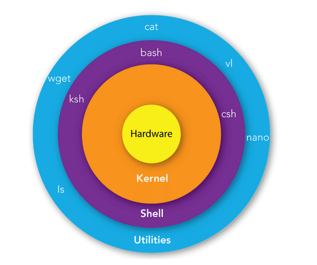

## Martes 12/08 

[Linux en 100 segundos](https://www.youtube.com/watch?v=rrB13utjYV4)

[Linux essentials](https://learning.lpi.org/es/learning-materials/010-160/)

[Labex playground](https://linux-commands.labex.io/)

### Operaciones basicas de directorio y archivos 

Comandos relevantes*:

`ls` - `cd` - `pwd` - `mkdir` - `touch` - `cp` - `mv` - `rm` - `ln` - `cat` - `tree` - `find` - `which` - `whereis` - `cksum` - `tee`, etc
*Revisarlos e interactuar en labex*

### Procesamiento de texto y edicion

Comandos relevantes*:
`grep` - `awk` - `sed` - `cut` - `uiniq` - `tail` - `diff` - `emacs` - `vi`, etc
*Revisarlos e interactuar en labex*


------------------

# Miercoles 13/08

[Linux essentials](https://learning.lpi.org/es/learning-materials/010-160/)

Practica 1 
Copiar el script [generar_paquete.sh](./generar_paquete.sh) al ambiente en linux 


## *Solucion* Actividad 1 — Organización de datos de sensores
**Escenario:**
Un prototipo de brazo robótico genera datos diarios de temperatura, posición y fuerza. Debes organizar los datos y preparar un reporte diario.

**Tareas:**
1. Copia todos los archivos del día `2025-08-11` a una carpeta `reporte_diario`.
  - Crear el directorio -> `mkdir reporte_diario`
  - Copiar TODOS los sensore del 2025-08-11 a reporte_diario -> `cp datos_iniciales/sensores/*/*2025-08-11.txt reporte_diario/`

3. Mueve los archivos de días anteriores a `historial/`.
  - Crear el directorio -> `mkdir historial`
  - Mover TODOS los sensores del 2025-08-11 a reporte_diario -> `mv datos_iniciales/sensores/*/*2025-08-10.txt historial/`

4. Lista la estructura final con `tree`.
  - utilizar el comando tree -> `tree proyecto_mecatronica/`
    - en caso de NO tener instalado tree, instalarlo -> `sudo apt install tree`
ej. 
```
proyecto_mecatronica/
├── 0_README.md
├── checklist_revisor.md
├── datos_iniciales
│   ├── config_robot_v1.txt
│   ├── config_robot_v2.txt
│   ├── frutas.txt
│   ├── log_dron.txt
│   ├── sensores
│   │   ├── fuerza
│   │   │   ├── fuerza_2025-08-11.txt
│   │   │   └── fuerza_2025-08-12.txt
│   │   ├── posicion
│   │   │   ├── pos_2025-08-11.txt
│   │   │   └── pos_2025-08-12.txt
│   │   └── temperatura
│   │       ├── temp_2025-08-11.txt
│   │       └── temp_2025-08-12.txt
│   └── temperaturas.csv
└── evaluar.sh
```

# Martes 19/08 - Miercoles 20/08

- [Shell Command Language](https://pubs.opengroup.org/onlinepubs/009695399/utilities/xcu_chap02.html#tag_02)
- [Bash Features](https://www.gnu.org/software/bash/manual/bash.html#Positional-Parameters)

**Bash: (Bourne SHELL -> BASH)** Command Language Interpreter tambien conocido como SHELL.


Al correr un commmando este es interpretado por SHELL para despues ser ejecutado en el sistema operativo (OS).

`which $SHELL` -> para ver que SHELL se utiliza "BASH, ZSH, etc".

e.j.

### script1.sh

```bash
#!/bin/zsh
echo "my first script"

GREET="HOLA PROGRA"

echo $GREET
```

### Mas comandos:

- `whatis` -> obtiene informacion a cerca de los comandos.
- `wget` -> descargar archivos de una red (intenet).
- `curl > namefile` -> obtener datos a traves de differentes protocolos (HTTP, FTP)
- Pipe operator: ejemplo
  - `ifconfig | grep en0 -A 6 | grep inet | awk '{print $2}'`
- `ps` - procesos por usuario
- `top` - analiza el rendimiento del sistema y sus customizaciones.
